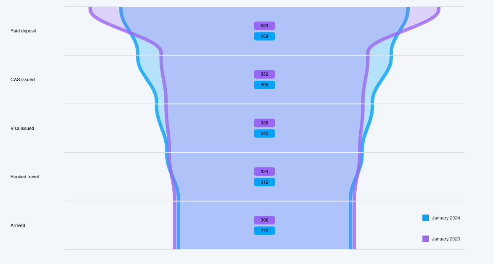

# Nivo Funnel ++

An extension to `@Nivo/Funnel` that adds functionality and features. 
A follow and star on the [Github Page](https://github.com/ryan-n-may/nivo_responsivefunnelplus)
would be highly appreciated. 


 


## Authors

- [@ryan-n-may](https://www.github.com/ryan-n-may)


## Features

- Unlimited datasets drawn per chart area.
- Auto-scaling input datasets relative to each other.  
- Colours customisable per dataset.
- Section labels.
- Stylised data labels. 
- Optional, fully customisable legend. 


## Installation

Install Funnel ++ with npm
([NPM package](https://www.npmjs.com/package/@ryan-n-may/funnelplus?activeTab=readme))
```bash
 npm install @ryan-n-may/funnelplus
```
```json
 "@ryan-n-may/funnelplus": "1.2.0"
```

## Dependencies
- @nivo/annotations
- @nivo/colors
- @nivo/core
- @nivo/tooltip
- @nivo/legends
- @react-spring/web
- @types/d3-scale
- @types/d3-shape
- d3-scale
- d3-shape

## Acknowledgements

 - [The Nivo Project](https://github.com/plouc/nivo)


## Documentation
```jsx
<ReactiveFunnelPlus
    ...={...} />
```
#### Additional paramaters:
| parameter                | type                                  
|--------------------------|---------------------------------------
| data                     | `FunnelDatum[] \| FunnelDatum[][]`
| colors                   | `OrdinalColorScaleConfig<FunnelDatum> \| OrdinalColorScaleConfig<FunnelDatum>[]`
| enableLegend             | `boolean`
| legendAnchor             | `bottom-right \| bottom-left \| bottom \| top \| top-left \| top-right \| right \| left \| undefined`
| legendItemDirection      | `left-to-right \| right-to-left \| top-to-bottom \| bottom-to-top`
| legendLayout             | `row \| column`
| legendSymbolShape        | `circle \| triangle \| diamond \| square \| undefined`
| enableLabel              | `boolean`
| enableAxisLabel          | `boolean`
| sectionLabelColor        | `OrdinalColorScaleConfig<FunnelDatum>`
| labelSpacing             | `number`
| labelDirection           | `row \| column`
| labelStyle               | `verbose \| pretty`
| labelFormat              | `(label: string) : string`
| labelColor               | `OrdinalColorScaleConfig<FunnelDatum>`
| layers                   | `['separators', 'parts', 'labels', 'axislabels', 'legend', 'annotations']`

#### Data input
A singular data entry (`FunnelDatum[]`) is structured as follows. 
Adding multiple datasets would require a 2D array (`FunnelDatum[][]`)
```
[
  {
    id: 'totoff',
    value: 2000,
    label: 'Total Offers',
    dataset: 'Dataset 1'
  },
  {
    id: 'finoff',
    value: 1200,
    label: 'Final Offers',
    dataset: 'Dataset 1'
  }
]
```

## Usage/Examples

```javascript
return(
    <ResponsiveFunnelPlus
        data = {[
            data[0],
            data[1],
        ]}
        colors = {[
            colorThemePalette.stackedBarChartColors.primary, 
            colorThemePalette.stackedBarChartColors.secondary, 
        ]}
        margin={{ top: 8, right: 64, bottom: 16, left: 128 }}
        fillOpacity={0.25}
        borderOpacity={0.8}
        borderWidth={8}
        shapeBlending={0.50}
        interpolation='smooth'
        direction={'vertical'}
        spacing={2}
        isInteractive={true}
        animate={true}
        currentPartSizeExtension={32}
        currentBorderWidth={16}
        motionConfig={'stiff'} 
        layers={['separators', 'parts', 'labels', 'axislabels', 'legend', 'annotations']}
        // Inputs exceed 100, so seperators need to reduce chart width.
        // Auto-scaling relatively scales chart datasets, but if maximal chart dataset exceeds
        // 100, additional seperators must be specified. 
        beforeSeparatorLength={Math.abs(data[0].data[1].value - data[1].data[1].value)}
        afterSeparatorLength={Math.abs(data[0].data[1].value - data[1].data[1].value)}
        // Legend
        enableLegend={true}
        legendAnchor={'bottom-right'}
        legendItemDirection={'left-to-right'}
        legendLayout={'column'}
        legendSymbolShape={'square'}         
        // Labels
        enableLabel={true}
        labelSpacing={0}
        labelDirection={'row'}
        labelStyle={'pretty'}
        labelFormat={() => {}} // Doesnt do anything here, we are using 'pretty'
        valueFormat={'>-.3s'}
        labelColor={{from: 'color', modifiers:[['darker', 1]]}}
        // Axis labels
        enableAxisLabel={true} 
        sectionLabelColor={'dark-gray'}
    >
)
```




